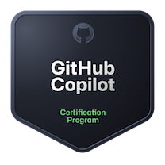
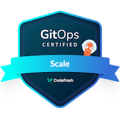
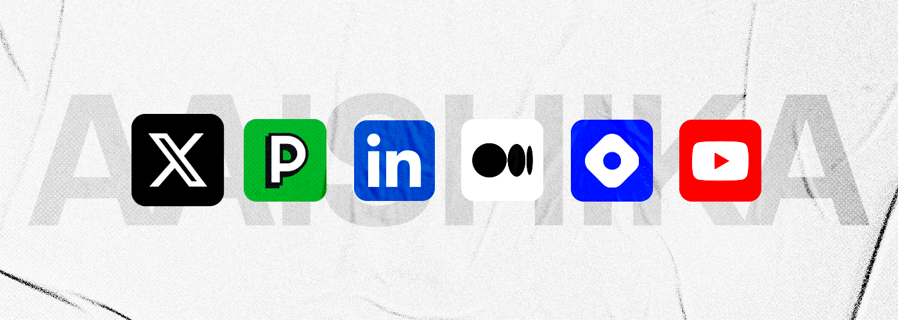

**Thanks for stopping by! 👋**

How many times have others visited?
\
 

## About Me 🤓

- 📣 I am Aaishika and I curate use-case-based content, organize community-centric events, and time to time write indecipherable code.
- 🚢 I design developer engagement programs and scale community initiatives at [`ngrok`](http://ngrok.com) as a `Community Manager`!
- 🦆 Find me building the randomest of things here.
- 🔭 Interests outside of Tech: Astronomy, Cinematography, ~~Watching stray cats cause ruckus~~

## Things I Do 🧑‍💻

### Community ◦ Open Source ◦ Development

> [!NOTE]
> Run `npx aaishika` for a quick intro on your terminal!

- 💼 Previously - Lead Developer Advocate at Toolhouse, Jr. Developer Advocate at [DigitalOcean](https://www.digitalocean.com), Developer Relations Intern at [codedamn](https://codedamn.com/) & Operations Intern at [Aviyel](https://www.aviyel.com).
- 🚩 And previously [GitHub Campus Expert](https://education.github.com/experts)!
- 👨🏻‍💻 Also previously; Coach at [Major League Hacking](https://www.mlh.io).
- 🌱 [GDSC Lead](https://developers.google.com/community/gdsc/leads) '22 & [Hack Club](https://hackclub.com/) Lead '21.
- 🛠️ Participated in hackathons avidly - check [Devpost](https://devpost.com/aaishika), [Devfolio](https://www.devfolio.com/@aaishika)!
- ✏️ Write blogs on [Hashnode](https://blogs.aaishika.com/) & [Medium](https://www.medium.com/@Aaishika).
- 📺 Upload beginner-friendly videos on my [YouTube Channel](https://www.youtube.com/c/AaishikaSBhattacharya)!

   

## Certifications 🏅

      

## Stack and Tools 🤯

### Currently Learning 👀

---
\
     

### Tools I Use 🛠️

---
\
                

## Get in Touch 📱

> [!NOTE]
> The username is [@aaishika](https://links.aaishika.com) on pretty much every platform, except GitHub because they won't adhere to their own [Name Squatting Policy](https://docs.github.com/en/site-policy/other-site-policies/github-username-policy#name-squatting-policy).

    
