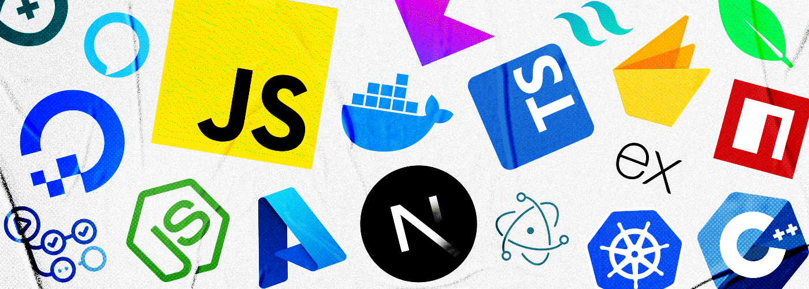

**Thanks for stopping by!**

## Things I Do 🧑‍💻

### Community ◦ Open Source ◦ Development

> Also `npx aaishika` for a quick intro on your terminal!

- Find me building the randomest of things here and scaling communities! 💪
- Mentor students and help budding developers be better!
- Jr. Developer Advocate at [DigitalOcean](https://www.digitalocean.com).
- Active [GitHub Campus Expert](https://education.github.com/experts)!
- [GDSC Lead](https://developers.google.com/community/gdsc/leads) '22 & [Hack Club](https://hackclub.com/) Lead '21.
- Previously - Developer Relations Intern at [codedamn](https://codedamn.com/) & Operations Intern at [Aviyel](https://www.aviyel.com).
- Also Previously - Coach at [Major League Hacking](https://www.mlh.io).
- Participate in hackathons avidly - check [Devpost](https://devpost.com/aaishika), [Devfolio](https://www.devfolio.com/@aaishika)!
- Write blogs on [Medium](https://www.medium.com/@Aaishika) & [Hashnode](https://blogs.aaishika.com/).
- Upload beginner-friendly videos on my [YouTube Channel](https://www.youtube.com/c/AaishikaSBhattacharya)!

   

## Stack and Tools 🤯

---

### Tech I've Worked With 🥷

---
\
                                 

---

### Tools I Use 🛠️

---
\
               

---

### Currently Learning 👀

---
\
    

## Get in Touch 📱

> The username is **aaishika** everywhere to be honest...

     

## Outro ✨

### 💬 "Out beyond ideas of wrongdoing and rightdoing, there is a field. I'll meet you there. When the soul lies down in that grass, the world is too full to talk about."

#### `Rumi`
